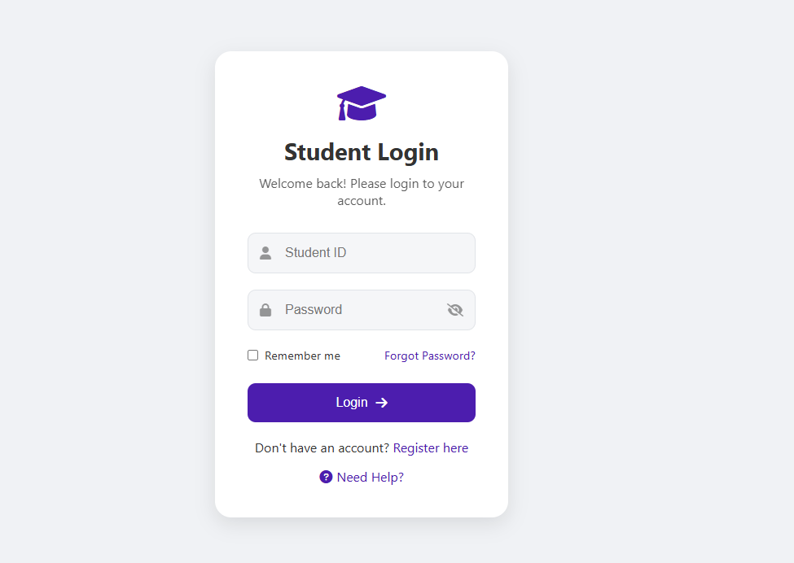

# Student Login Form 🎓

A modern, responsive student login interface with form validation.



## ✨ Features

- Responsive design for all devices
- Form validation
- Password visibility toggle
- Remember me functionality
- Error handling & user feedback
- Smooth animations
- Modern UI design

## 🛠️ Technologies Used

- HTML5
- CSS3 (with custom properties)
- JavaScript (ES6+)
- Font Awesome Icons

## 📁 Project Structure

```
student-login/
├── index.html
├── assets/
│   ├── css/
│   │   └── style.css
│   ├── js/
│   │   └── script.js
│   └── img/
│       └── preview.png
└── README.md
```

## 🚀 Getting Started

1. Clone the repository:
```bash
git clone https://github.com/your-username/student-login.git
```

2. Navigate to project directory:
```bash
cd student-login
```

3. Open `index.html` in your browser or use a local server:
```bash
python -m http.server
```

## 💡 Usage

### Form Validation Rules

- **Student ID:**
  - Must be 8 digits
  - Cannot be empty
  - Numbers only

- **Password:**
  - Minimum 8 characters
  - Must contain at least one letter
  - Must contain at least one number

### Theme Switching

- Click the sun/moon icon to toggle between light and dark themes
- Theme preference is saved in local storage

## 🎨 Customization

### Modifying Colors

Edit the CSS variables in `style.css`:

```css
:root {
    --primary-color: #4c1dae;
    --hover-color: #3a1685;
    /* ... other variables */
}
```

### Changing Validation Rules

Modify the validation logic in `script.js`:

```javascript
function validateForm() {
    // Edit validation rules here
}
```

## 📱 Responsive Design

- Desktop optimized (>1024px)
- Tablet friendly (768px - 1024px)
- Mobile responsive (<768px)

## ⚙️ Browser Support

- Chrome (latest)
- Firefox (latest)
- Safari (latest)
- Edge (latest)

## 🤝 Contributing

1. Fork the repository
2. Create your feature branch (`git checkout -b feature/AmazingFeature`)
3. Commit your changes (`git commit -m 'Add some AmazingFeature'`)
4. Push to the branch (`git push origin feature/AmazingFeature`)
5. Open a Pull Request

## 📝 License

This project open source


## 🙋‍♂️ Support

For support, open an issue in the repository.

## 🙏 Acknowledgments

- Font Awesome for icons
- Modern form design inspiration


